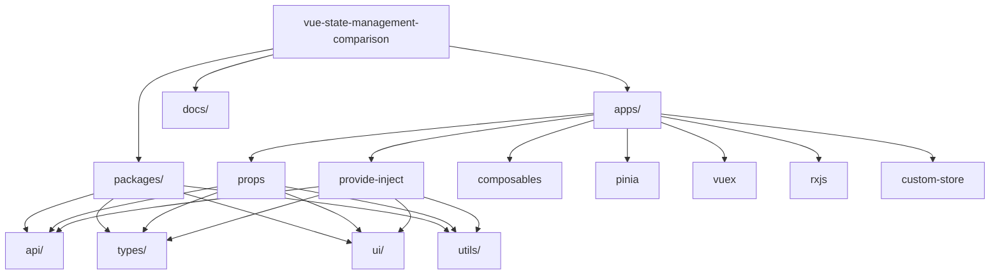
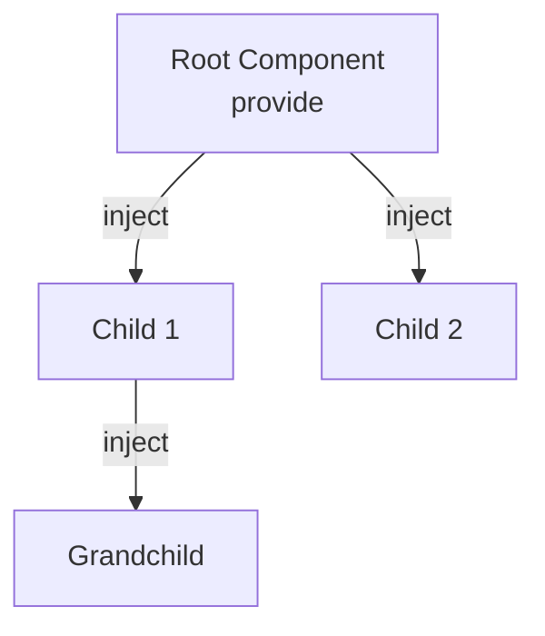
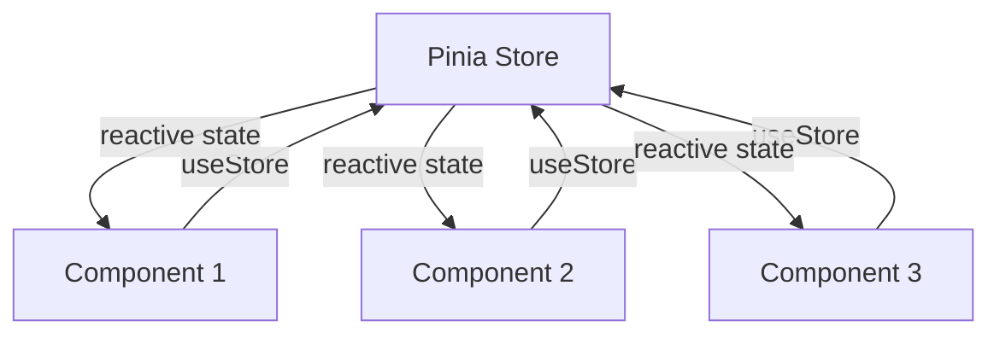
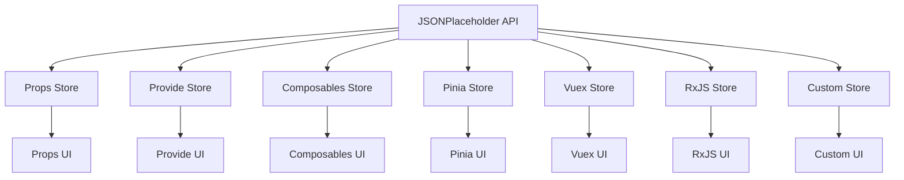

# Vue State Management Patterns Comparison

This document provides a comprehensive comparison of the 7 state management patterns implemented in Vue State Management Comparison.

## 📊 Quick Comparison Table

| Pattern | Complexity | Boilerplate | Performance | Scalability | Learning Curve | Best For |
|---------|-----------|-------------|-------------|-------------|----------------|----------|
| Props & Emits | ⭐ Low | ⭐ Low | ⭐⭐⭐ High | ⭐ Low | ⭐ Easy | Small apps |
| Provide/Inject | ⭐⭐ Medium | ⭐⭐ Medium | ⭐⭐⭐ High | ⭐⭐ Medium | ⭐⭐ Medium | Deep trees |
| Composables | ⭐⭐ Medium | ⭐⭐ Medium | ⭐⭐⭐ High | ⭐⭐⭐ High | ⭐⭐ Medium | Reusable logic |
| Pinia | ⭐⭐ Medium | ⭐⭐ Medium | ⭐⭐⭐ High | ⭐⭐⭐⭐ Very High | ⭐⭐ Medium | Production apps |
| Vuex | ⭐⭐⭐ High | ⭐⭐⭐ High | ⭐⭐ Medium | ⭐⭐⭐⭐ Very High | ⭐⭐⭐ Hard | Legacy/Vue 2 |
| RxJS | ⭐⭐⭐⭐ Very High | ⭐⭐⭐ High | ⭐⭐ Medium | ⭐⭐⭐ High | ⭐⭐⭐⭐ Very Hard | Complex async |
| Custom Store | ⭐⭐⭐ High | ⭐⭐⭐ High | ⭐⭐ Medium | ⭐⭐ Medium | ⭐⭐⭐ Hard | Learning/Custom |

## 🔍 Detailed Analysis

### 1. Props & Emits

**Pattern:** Traditional parent-child component communication

#### 1.1 Pros ✅

- Simple and intuitive
- No external dependencies
- Excellent performance (direct prop passing)
- Easy to understand for beginners
- Built into Vue core

#### 1.2 Cons ❌

- Prop drilling in deep component trees
- Difficult to share state across unrelated components
- Limited scalability
- Can become verbose with many props

#### 1.3 Boilerplate Size

```typescript
// Minimal - just props and emits
<PostCard :post="post" @edit="handleEdit" />
```

#### 1.4 Performance

- ⭐⭐⭐ Excellent - Direct prop passing, no overhead
- No reactivity overhead
- Fast updates

#### 1.5 Scalability

- ⭐ Limited - Best for small to medium apps
- Breaks down with deep nesting (>3-4 levels)

#### 1.6 Learning Curve

- ⭐ Very Easy - Core Vue concept

#### 1.7 Use Cases

- Small applications (< 10 components)
- Simple parent-child relationships
- Learning Vue.js

---

### 2. Provide/Inject

**Pattern:** Dependency injection for deep component trees

#### 2.1 Pros ✅

- Eliminates prop drilling
- Clean component interfaces
- Good performance
- Built into Vue core
- Flexible injection keys

#### 2.2 Cons ❌

- Less explicit than props
- Can be harder to trace data flow
- Not reactive by default (need to use `ref`/`reactive`)
- Requires careful key management

#### 2.3 Boilerplate Size

```typescript
// Provider
provide(PostsStoreKey, store);

// Consumer
const store = inject(PostsStoreKey);
```

#### 2.4 Performance

- ⭐⭐⭐ Excellent - Similar to props, minimal overhead
- Slight overhead from injection lookup

#### 2.5 Scalability

- ⭐⭐ Good - Better than props for deep trees
- Still limited for cross-component sharing

#### 2.6 Learning Curve

- ⭐⭐ Medium - Requires understanding of provide/inject API

#### 2.7 Use Cases

- Deep component hierarchies
- Avoiding prop drilling
- Plugin/component library development

---

### 3. Composables

**Pattern:** Reusable Composition API functions

#### 3.1 Pros ✅

- Highly reusable
- Composable and testable
- TypeScript-friendly
- No external dependencies
- Follows Vue 3 Composition API patterns
- Can be shared across components easily

#### 3.2 Cons ❌

- Each component instance gets its own state (unless using singleton pattern)
- Requires understanding of Composition API
- Can lead to state duplication if not careful

#### 3.3 Boilerplate Size

```typescript
// Composable
export function usePosts() {
  const posts = ref([]);
  // ... logic
  return { posts, fetchPosts, ... };
}

// Usage
const { posts, fetchPosts } = usePosts();
```

#### 3.4 Performance

- ⭐⭐⭐ Excellent - Direct Vue reactivity
- No additional overhead

#### 3.5 Scalability

- ⭐⭐⭐ Excellent - Highly scalable with proper patterns
- Can use singleton pattern for shared state

#### 3.6 Learning Curve

- ⭐⭐ Medium - Requires Composition API knowledge

#### 3.7 Use Cases

- Reusable stateful logic
- Component composition
- Modern Vue 3 applications
- Shared business logic

---

### 4. Pinia

**Pattern:** Official Vue state management library

#### 4.1 Pros ✅

- Official Vue recommendation
- TypeScript support out of the box
- DevTools integration
- Modular store structure
- No mutations (direct state modification)
- Composition API style
- Excellent TypeScript inference
- Hot module replacement support

#### 4.2 Cons ❌

- Additional dependency
- Learning curve for store structure
- Slight bundle size increase

#### 4.3 Boilerplate Size

```typescript
// Store definition
export const usePostsStore = defineStore('posts', () => {
  const posts = ref([]);
  // ... logic
  return { posts, fetchPosts, ... };
});

// Usage
const store = usePostsStore();
```

#### 4.4 Performance

- ⭐⭐⭐ Excellent - Optimized reactivity
- Minimal overhead
- Efficient updates

#### 4.5 Scalability

- ⭐⭐⭐⭐ Excellent - Designed for large applications
- Modular architecture
- Easy to split into multiple stores

#### 4.6 Learning Curve

- ⭐⭐ Medium - Similar to Composables but with store structure

#### 4.7 Use Cases

- Production applications
- Medium to large applications
- Teams needing official solution
- Applications requiring DevTools

---

### 5. Vuex

**Pattern:** Legacy state management (Vue 3 compatible)

#### 5.1 Pros ✅

- Mature and battle-tested
- Large ecosystem
- DevTools support
- Well-documented
- Familiar to Vue 2 developers

#### 5.2 Cons ❌

- More verbose (mutations, actions, getters)
- Steeper learning curve
- Not officially recommended for new projects
- More boilerplate than Pinia

#### 5.3 Boilerplate Size

```typescript
// Store definition
export default createStore({
  state: { posts: [] },
  mutations: { SET_POSTS(state, posts) { ... } },
  actions: { async fetchPosts({ commit }) { ... } },
  getters: { filteredPosts: (state) => { ... } }
});

// Usage
const store = useStore();
store.dispatch('fetchPosts');
```

#### 5.4 Performance

- ⭐⭐ Good - Slight overhead from mutation system
- Still performant for most use cases

#### 5.5 Scalability

- ⭐⭐⭐⭐ Excellent - Proven at scale
- Module system for large apps

#### 5.6 Learning Curve

- ⭐⭐⭐ Hard - Requires understanding mutations, actions, getters

#### 5.7 Use Cases

- Migrating Vue 2 applications
- Teams already familiar with Vuex
- Large existing codebases

---

### 6. RxJS

**Pattern:** Reactive programming with observables

#### 6.1 Pros ✅

- Powerful async handling
- Rich operator ecosystem
- Excellent for complex data flows
- Time-based operations
- Backpressure handling
- Composable streams

#### 6.2 Cons ❌

- Steep learning curve
- Can be overkill for simple apps
- Additional bundle size
- Requires understanding of reactive programming
- Integration complexity with Vue

#### 6.3 Boilerplate Size

```typescript
// Store
const state$ = new BehaviorSubject(initialState);
export const posts$ = state$.pipe(map(state => state.posts));

// Usage (requires composable wrapper)
const { posts } = useRxStore();
```

#### 6.4 Performance

- ⭐⭐ Good - Observable overhead
- Can be optimized with proper operators

#### 6.5 Scalability

- ⭐⭐⭐ Good - Excellent for complex async flows
- Can become complex with many streams

#### 6.6 Learning Curve

- ⭐⭐⭐⭐ Very Hard - Requires understanding reactive programming

#### 6.7 Use Cases

- Complex asynchronous data flows
- Real-time applications
- Event-driven architectures
- Applications with time-based operations

---

### 7. Custom Store

**Pattern:** Event-based custom implementation

#### 7.1 Pros ✅

- Full control over implementation
- Can be tailored to specific needs
- Educational value
- No external dependencies
- Lightweight if done right

#### 7.2 Cons ❌

- Maintenance burden
- Need to implement features yourself
- No ecosystem support
- Potential bugs
- Time-consuming to build properly

#### 7.3 Boilerplate Size

```typescript
// Custom store class
class PostsStore {
  private state = reactive({ posts: [] });
  private listeners = new Map();
  
  on(event, callback) { ... }
  emit(event, payload) { ... }
  // ... methods
}

// Usage
const store = postsStore;
```

#### 7.4 Performance

- ⭐⭐ Good - Depends on implementation
- Event system overhead

#### 7.5 Scalability

- ⭐⭐ Medium - Depends on implementation quality
- Can be scaled with proper architecture

#### 7.6 Learning Curve

- ⭐⭐⭐ Hard - Need to understand state management internals

#### 7.7 Use Cases

- Learning state management internals
- Custom requirements not met by existing solutions
- Educational projects

---

## 📈 Performance Comparison

### Bundle Size Impact

| Pattern | Additional Bundle Size | Notes |
|---------|----------------------|-------|
| Props & Emits | 0 KB | Built into Vue |
| Provide/Inject | 0 KB | Built into Vue |
| Composables | 0 KB | Built into Vue |
| Pinia | ~5 KB | Minimal overhead |
| Vuex | ~10 KB | Larger than Pinia |
| RxJS | ~50 KB | Significant size |
| Custom Store | 0-5 KB | Depends on implementation |

### Runtime Performance

All patterns perform well for typical applications. The differences become noticeable only at scale:

1. **Props & Emits** - Fastest (direct prop passing)
2. **Provide/Inject** - Very fast (minimal lookup overhead)
3. **Composables** - Very fast (direct reactivity)
4. **Pinia** - Fast (optimized reactivity)
5. **Vuex** - Good (mutation system overhead)
6. **RxJS** - Good (observable overhead)
7. **Custom Store** - Varies (depends on implementation)

## 🎯 Recommendations

### For Small Apps (< 10 components)

- **Props & Emits** or **Composables**

### For Medium Apps (10-50 components)

- **Composables** or **Pinia**

### For Large Apps (> 50 components)

- **Pinia** (recommended) or **Vuex** (if migrating)

### For Deep Component Trees

- **Provide/Inject** or **Pinia**

### For Complex Async Flows

- **RxJS** (if team has expertise) or **Pinia** with async patterns

### For Learning

- Start with **Props & Emits** → **Composables** → **Pinia**

## 🔄 Migration Paths

### Vue 2 → Vue 3

1. **Vuex** → **Pinia** (recommended migration path)
2. **Vuex** → **Composables** (for smaller apps)

### Props → Better Solution

1. **Props** → **Provide/Inject** (if prop drilling)
2. **Props** → **Composables** (if sharing logic)
3. **Props** → **Pinia** (if app is growing)

## 📚 Mermaid Diagrams

### Monorepo Structure



### Data Flow - Props & Emits


### Data Flow - Provide/Inject



### Data Flow - Pinia



### Store Pattern Visualization



---

**Last Updated:** 2024  
**Version:** 1.0.0
